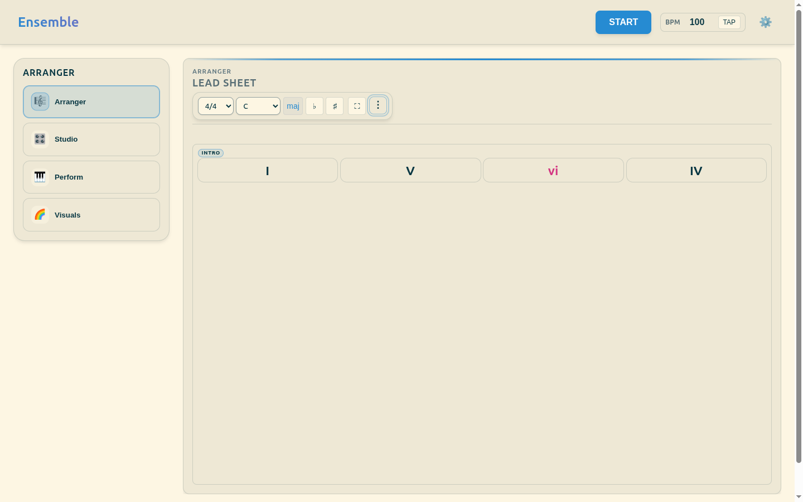
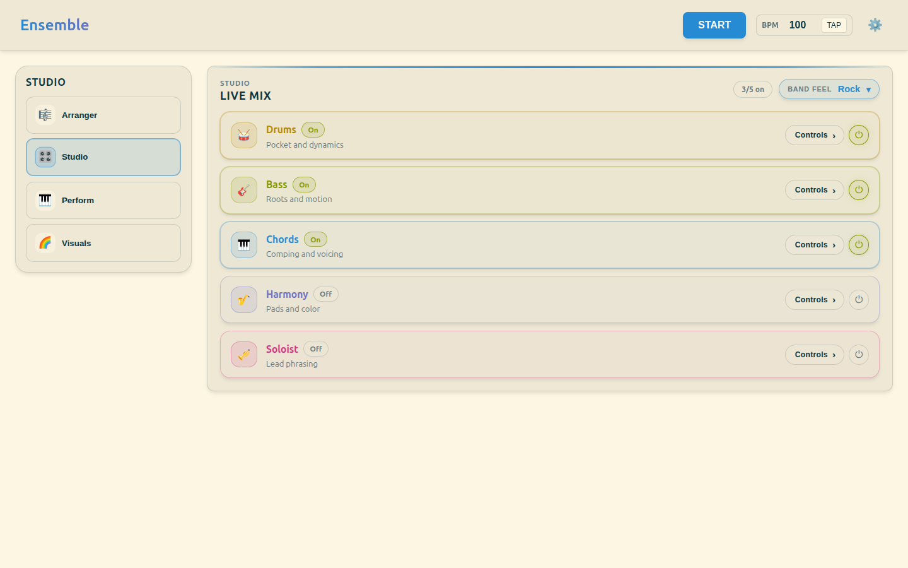
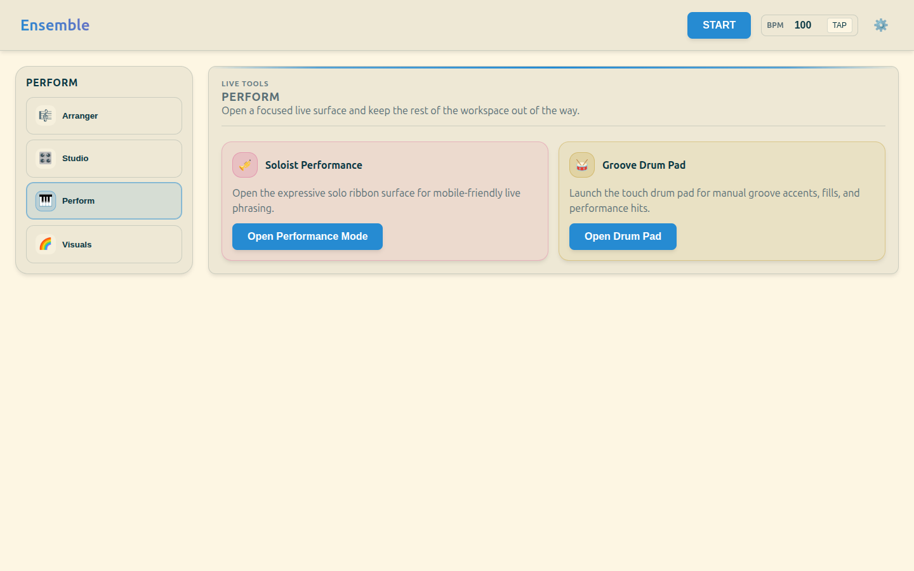
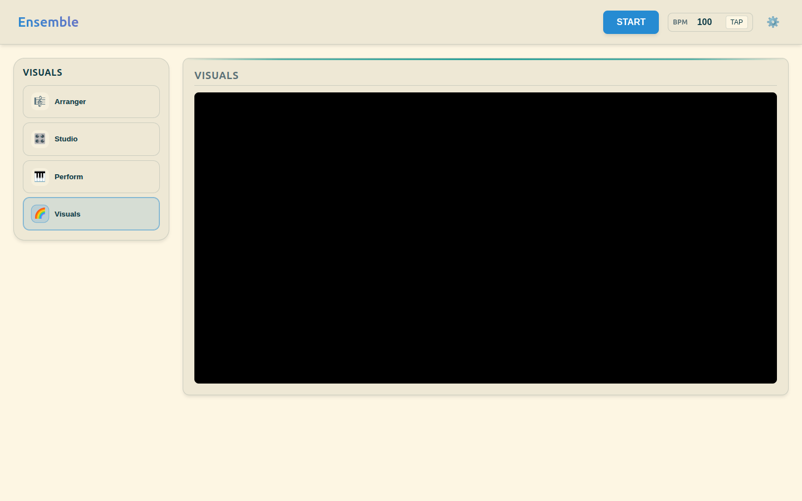

# Ensemble

Ensemble is a browser-based virtual band and songwriting toolkit. It generates real-time drums, bass, chords, harmony, and solo lines that respond to your progression, genre, and intensity choices.

It is built as a PWA, runs from the browser, and is designed for fast ideas: sketch a progression, hear the band interpret it immediately, and move between writing, performing, and visualizing without leaving the app.

## What Ensemble does

- Builds full arrangements from chord charts and song sections.
- Adapts the band feel with smart genre presets.
- Lets you tune the live mix per instrument in Studio.
- Launches performance-focused surfaces for soloing and drums.
- Provides a visualizer workspace for harmonic playback.
- Includes audio analysis and melody-to-harmony tooling.
- Exports and routes MIDI for DAWs and external gear.

## Workspaces

Ensemble is organized around four main workspaces:

- **Arranger**: Shape chords, sections, transposition, sharing, and progression library access.
- **Studio**: Choose the band feel, toggle instruments, and adjust per-instrument settings.
- **Perform**: Open focused live tools for soloist performance and the drum pad.
- **Visuals**: Give the visualizer room to breathe while playback continues.

## Workspace screenshots

<p><em>A quick desktop tour of the four main workspaces.</em></p>

<table>
  <tr>
    <td align="center">
      
      <br /><strong>Arranger</strong>
    </td>
    <td align="center">
      
      <br /><strong>Studio</strong>
    </td>
  </tr>
  <tr>
    <td align="center">
      
      <br /><strong>Perform</strong>
    </td>
    <td align="center">
      
      <br /><strong>Visuals</strong>
    </td>
  </tr>
</table>

## Getting started

```bash
npm install
npm run dev
```

`npm run dev` builds the app and serves the generated bundle on `http://localhost:5173`. It is a preview server, not a hot-reload dev server.

Once the app is running, you can:

1. Open **Arranger** and enter a chord progression.
2. Switch to **Studio** to pick a band feel and adjust the mix.
3. Use **Perform** to launch the soloist or drum pad.
4. Move to **Visuals** when you want the visualizer full-width.

## Common commands

```bash
npm run build
npm test
npm run test:e2e
npm run validate
```

- `npm run build` creates a production-style dry run in `dist/`.
- `npm test` runs linting and the Vitest suite.
- `npm run test:e2e` runs the Playwright smoke suite.
- `npm run validate` performs the full repo validation pipeline.
- `npm run ensemble:report -- --genre=Jazz --seeds=ALPHA,BETA` emits a compact multi-seed ensemble audit as JSON.
- `npm run mix:report -- --jsonl --scene=jazz-ride --seeds=ALPHA,BETA` emits rendered-audio metrics as JSONL for a compact multi-seed scene sweep.
- `npm run mix:report -- --json --focus-from=report.json` rerenders an `ensemble:report` focus shortlist through the actual audio path and emits machine-readable mix metrics.
- `npm run mix:report -- --write-wav=tmp/mix-render --scene=jazz-ride --seeds=ALPHA` also writes one `.wav` per scene/stem/seed combination (`{sceneId}-{stemId}-{seed}.wav`) so the rendered audio can be auditioned without spinning up the live app. Output dir is gitignored.
- `npm run --silent mix:diff -- before.json after.json` compares two `mix:report --json` outputs and surfaces stems whose dynamics or spectral balance moved beyond a configurable threshold (defaults: ±1.5 dB, ±5% spectral, ±1.5 spikes/sec). Exits 1 if any significant delta is found.
- `npm run --silent audition-link -- --scene=jazz-ride --seed=ALPHA` builds an autoplay-ready URL for one of the named scenes; opening it in the running app hydrates the scene and shows a one-click "▶ Play" overlay. See [`docs/guides/listening-gate-tools.md`](docs/guides/listening-gate-tools.md) for the full workflow.

## Documentation

- [`docs/README.md`](docs/README.md) — documentation index and repo navigation hub.
- [`docs/VISION.md`](docs/VISION.md) — current open work and product direction.
- [`public/MANUAL.md`](public/MANUAL.md) — the in-app manual, including generated reference tables.
- [`CLAUDE.md`](CLAUDE.md) — operational rules and architectural overview for AI-assisted work. (`AGENTS.md` points here.)
- [`AI_MAP.md`](AI_MAP.md) — a navigation map for the codebase.
- [`.github/CONTRIBUTING.md`](.github/CONTRIBUTING.md) — contributor workflow and validation expectations.
- [`.github/SECURITY.md`](.github/SECURITY.md) — private vulnerability reporting.
- [`.github/CODE_OF_CONDUCT.md`](.github/CODE_OF_CONDUCT.md) — community standards.
- [`docs/guides/`](docs/guides/) — deeper implementation notes and reference guides.
- [`tests/README.md`](tests/README.md) — test-suite conventions and how to run checks.
- [`.vscode/mcp.json`](.vscode/mcp.json) — optional VS Code Playwright MCP workspace helper.

## Tech stack

- **UI**: Preact
- **State**: deep-signal domain slices
- **Audio and generation**: WebAudio plus worker-driven logic
- **Build**: Vite (with `vite-plugin-pwa` for the service worker)
- **Testing**: Vitest and Playwright

## Repository layout

- `public/` — app source, controllers, engines, components, and styles
- `tests/` — unit, integration, standards, perf, and e2e coverage
- `docs/` — docs index, living guides, roadmap, and archived reports
- `.github/` — contributor, security, and pull request templates
- `.vscode/` — optional workspace helpers, including Playwright MCP
- `scripts/` — repo maintenance and analysis tooling

## License

GNU Affero General Public License v3.0. See [LICENSE](LICENSE) for details.
